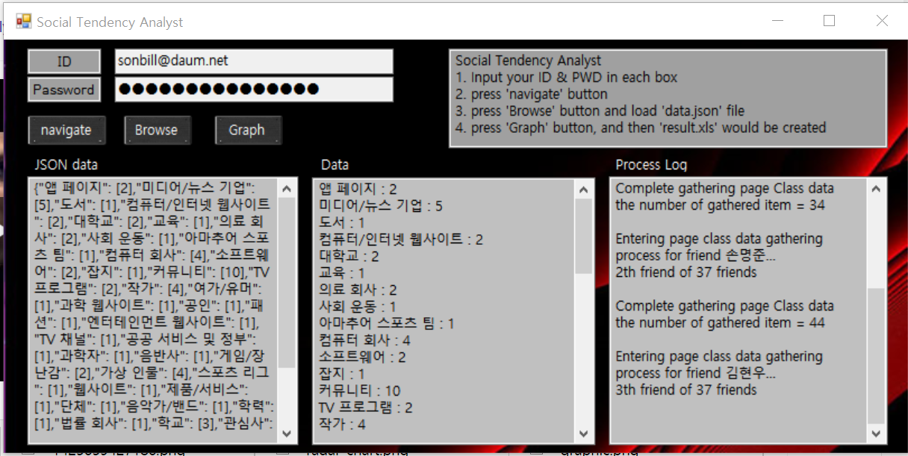

# Explanation
This project, refered as 'Social Tendency Analyst', provides a graph that contains data about tendency of a group that a user belongs, by gathering "Likes" data from 'facebook'.

# Outline

 
"유유상종" 
우리에겐 많은 페이스북 친구들이 있다. 친구들은 여러 페이지에 대해 좋아요를 눌렀고, 각 페이지들은 몇 가지의 항목으로 분류될 수 있다. 
페이지들의 항목별 통계값을 모아 방사형 그래프로 나타내어 사용자의 성향을 분석, 시각화하는 소프트웨어이다.
 
## 사용 언어
* C#
* Python
## 사용된 라이브러리
* CEFsharp : chromium 기반 브라우저를 제공한다.
* Spire.xls : c# 코드 내에서 엑셀 파일을 편집할 수 있게 해준다.
* HtmlAgilityPack : html코드를 가져오고 파싱하기 위해 사용하는 라이브러리이다.
* IronPython : c# 코드 내에서 Python 코드를 실행할 수 있게 해준다.

# How to use
1. Main window

There are four textboxes, one for input Id and Password, another for showing JSON data, the other for showing crawled data, and last for showing progress log. 
And there are three buttons, one for opening Crawling Browser, named navigate button, another for loading json file, named browse button, and Graph button for generating Graph.

2. 

If you press navigate button, you'll show this window. 
There are five buttons, and each button has each functions.
* Login : Automatically input Id and Password to browser.
* getCode : get html code from browser.
* Quit : forcedly quit crawling.
* DEV tool : open developer's tool for chromium browser.
* Suspend : suspend crawling for a while.

And there are three textboxes.
* Get data for \[    \] people : set amount of number for crawling, because in order to crawl all of your friends, it takes three or four hours...
* Left Time : show left time for crawling current friend.
* Expected : show expected left time for the end of crawling.

3.

Log in, and press getData button. Then this window will start crawling. 
For the end of crawling each friend's data, three textboxes of mainwindow will refresh its contents. 

4.

When the crawling task end, press 'browse' button and select 'data.json' file. 
Then, press 'Graph' button, and this window will generate graph of gathered data. 

5.

When all the tasks above finished, find "Result.xls" file and open it. 
You'll see the graph with 13 vertexes.  
Enjoy your result!

# Developer
M.J, Son  
2nd grade, KDMHS

# Relaesed version
https://drive.google.com/open?id=0B_WUoAZUAnvuMzdya09qeXNwWTg
